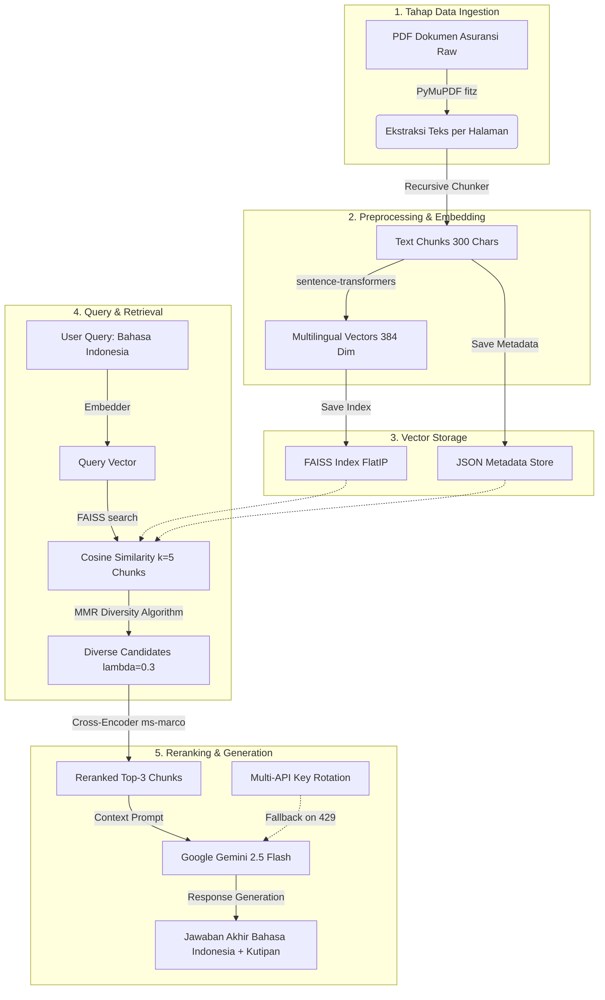

# 🤖 Bilingual Insurance RAG Portfolio Project (From Scratch)

[](https://huggingface.co/spaces/BintangIsTheBest/rag-insurance-backend)
[](https://opensource.org/licenses/MIT)
[](https://www.python.org/downloads/)
[](https://fastapi.tiangolo.com/)

Proyek ini adalah sistem **Retrieval-Augmented Generation (RAG) bilingual** yang dibangun **dari nol (from scratch)** tanpa menggunakan framework high-level seperti *LangChain* atau *LlamaIndex*. Proyek ini dirancang sebagai portofolio teknis yang mendemonstrasikan implementasi modular setiap tahapan pipeline RAG.

Sistem ini mendukung pencarian **cross-lingual**: pengguna dapat mengajukan pertanyaan dalam **Bahasa Indonesia** terhadap basis data dokumen polis/panduan asuransi berbahasa **Inggris** (USA States Guides). Jawaban yang dihasilkan diformulasikan ke dalam Bahasa Indonesia yang formal, sopan, serta menyertakan kutipan sumber (*citations*) dokumen asli dan nomor halamannya secara akurat.

---

## 📐 Arsitektur Sistem & Pipeline RAG

Proyek ini menerapkan arsitektur **Advanced RAG** modular yang dibagi menjadi 8 tahapan logis. Alur data dari dokumen mentah hingga jawaban pengguna digambarkan sebagai berikut:



---

## 🛠️ Rincian Komponen Pipeline

### 1. Document Extraction (`src/document_loader.py`)
*   **Tools**: `PyMuPDF` (`fitz`).
*   **Implementasi**: Membaca dokumen PDF dari folder `data/raw_documents/`. Teks diekstrak per halaman secara terstruktur dengan menyimpan informasi metadata penting (nama file dokumen asli dan nomor halaman).
*   **Alasan**: PyMuPDF dipilih karena kecepatan ekstrasinya yang sangat tinggi dan kestabilannya di OS Windows dibandingkan library PDF parser lainnya.

### 2. Text Chunking (`src/chunker.py`)
*   **Algoritma**: *Recursive Character Chunking* yang diimplementasikan secara manual.
*   **Konfigurasi**: `chunk_size = 300` karakter dengan `overlap = 30` karakter.
*   **Implementasi**: Melakukan pemisahan teks berdasarkan prioritas batas tanda baca (paragraf `\n\n`, baris baru `\n`, spasi ` `, dan karakter kosong `""`) untuk menjaga konteks kalimat tidak terpotong di tengah jalan. Informasi halaman (`page_number`) diwariskan ke setiap chunk untuk kepentingan sitasi.

### 3. Vector Embedding (`src/embedder.py`)
*   **Model**: `sentence-transformers/paraphrase-multilingual-MiniLM-L12-v2` (berjalan secara **lokal** menggunakan CPU/GPU).
*   **Dimensi Vektor**: 384 dimensi.
*   **Alasan**: Model ini dilatih secara khusus untuk mendukung representasi *shared multilingual space* (50+ bahasa termasuk Indonesia dan Inggris). Artinya, kalimat Bahasa Indonesia *"Bagaimana cara klaim?"* akan memiliki kedekatan spasial (jarak kosinus yang sangat dekat) dengan kalimat Bahasa Inggris *"How to file a claim?"* dalam ruang vektor.

### 4. Vector Storage (`src/vector_store.py`)
*   **Database**: `FAISS` (`faiss-cpu`) dengan indeks tipe **Flat Inner Product (IndexFlatIP)**.
*   **Implementasi**: Vektor embedding dinormalisasi ($L_2$ normalized) terlebih dahulu sebelum dimasukkan ke dalam FAISS Index. Hal ini mengubah perhitungan *Inner Product* menjadi pencarian **Cosine Similarity** yang sangat presisi. 
*   **Penyimpanan**: Indeks FAISS (`index.faiss`), data embedding asli (`embeddings.npy`), dan metadata JSON (`metadata.json`) disimpan di folder `data/processed/faiss_store/` untuk menghindari re-indexing berulang saat aplikasi dinyalakan.

### 5. Retrieval & MMR Diversity (`src/retriever.py`)
*   **Algoritma**: *Maximal Marginal Relevance (MMR)* diimplementasikan secara manual menggunakan Numpy.
*   **Konfigurasi**: `fetch_k = 5` kandidat teratas, disaring menjadi `top_k = 3` menggunakan $\lambda = 0.3$.
*   **Alasan**: Jika hanya menggunakan Cosine Similarity biasa, konten yang dikembalikan sering kali redundan (memuat informasi yang sama berulang-ulang). MMR menyeimbangkan antara relevansi query (similaity) dengan keberagaman informasi (*diversity* / novelty) dari dokumen yang ditarik. Rumus MMR yang digunakan:
    $$\text{MMR} = \arg\max_{D_i \in R \setminus S} \left[ \lambda \cdot \text{Sim}_1(D_i, Q) - (1 - \lambda) \cdot \max_{D_j \in S} \text{Sim}_2(D_i, D_j) \right]$$

### 6. Reranking (`src/reranker.py`)
*   **Model**: Cross-Encoder `cross-encoder/ms-marco-MiniLM-L-6-v2` (berjalan secara **lokal**).
*   **Alasan**: Bi-Encoder (embedding model) sangat cepat untuk retrieval awal tetapi kurang peka terhadap hubungan semantik yang mendalam. Reranker (Cross-Encoder) memproses query dan dokumen kandidat secara bersamaan menggunakan mekanisme *self-attention* penuh untuk menilai relevansi secara lebih akurat. Ini secara signifikan menyaring dokumen sampah dan menaikkan dokumen yang paling relevan ke peringkat teratas (`top-k`).

### 7. Generation & Multi-API Key Rotation (`src/rag_pipeline.py`)
*   **LLM**: Google Gemini API (`gemini-2.5-flash`).
*   **Prompt Engineering**: Menggunakan instruksi sistem yang ketat agar model **hanya** menjawab berdasarkan konteks dokumen berbahasa Inggris yang diberikan (menghindari halusinasi), memformulasikan jawaban dalam Bahasa Indonesia yang formal dan ramah, serta secara eksplisit menuliskan referensi nama dokumen & halaman.
*   **Rotasi API Key (Round-Robin)**: Untuk mengatasi batasan kuota gratis Gemini API yang ketat, modul `RAGPipeline` dikonfigurasi untuk membaca daftar API key yang dipisahkan koma (`GEMINI_API_KEYS`). Jika terjadi error kuota limit (`ResourceExhausted / HTTP 429`), pipeline akan secara dinamis memutar token ke key berikutnya dan mengulang request secara transparan tanpa mengganggu pengalaman pengguna.

### 8. Evaluasi RAGAS (`evaluation/ragas_evaluation.ipynb`)
*   **Metrik Evaluasi**: Menggunakan framework **RAGAS** untuk menguji performa sistem:
    1.  *Faithfulness*: Mengukur apakah jawaban hanya berasal dari konteks (menghindari halusinasi).
    2.  *Answer Relevance*: Mengukur seberapa relevan jawaban LLM dengan pertanyaan pengguna.
    3.  *Context Recall*: Mengukur apakah retriever berhasil menarik semua informasi yang dibutuhkan.
    4.  *Context Precision*: Mengukur apakah potongan dokumen yang relevan berada di peringkat teratas.

---

## 📂 Struktur Proyek

```
Project RAG/
├── data/
│   ├── raw_documents/          # Dokumen PDF asli panduan asuransi (Inggris)
│   └── processed/              # Hasil ekstraksi teks, chunking, & indeks FAISS
├── src/                        # Modul Inti Pipeline RAG (Modular)
│   ├── __init__.py
│   ├── document_loader.py      # Pembaca PDF
│   ├── chunker.py              # Segmentasi teks rekursif
│   ├── embedder.py             # Pembuat representasi vektor
│   ├── vector_store.py         # Pengelola database FAISS
│   ├── retriever.py            # Pencarian Cosine & MMR
│   ├── reranker.py             # Cross-Encoder reranking
│   ├── rag_pipeline.py         # Orkestrator RAG & Rotasi API Key
│   └── config.py               # Parameter & konfigurasi model
├── backend/
│   └── app.py                  # API controller FastAPI
├── frontend/
│   ├── index.html              # Chat UI (Glassmorphic, Responsive)
│   ├── style.css               # Styling Vanilla CSS (100dvh mobile)
│   └── app.js                  # Handler UI, Cold-start health polling
├── notebooks/                  # 7 Notebook Eksperimen & Pembelajaran Step-by-Step
├── evaluation/                 # Notebook evaluasi kualitas menggunakan RAGAS
├── tests/                      # Unit testing suite (16/16 tests passing)
├── requirements.txt            # Dependensi Python
├── Dockerfile                  # Konfigurasi deploy HuggingFace Spaces
└── README.md                   # Dokumentasi proyek (file ini)
```

---

## 🚀 Cara Menjalankan Secara Lokal

### 1. Install Dependensi
Pastikan Python 3.10+ terpasang, lalu jalankan:
```bash
pip install -r requirements.txt
```

### 2. Konfigurasi Environment (`.env`)
Buat berkas `.env` di root folder proyek dan masukkan API Key Gemini Anda:
```env
GEMINI_API_KEYS=key_pertama,key_kedua,key_ketiga
GOOGLE_API_KEY=key_pertama
```

### 3. Jalankan Pengujian Otomatis (Unit Test)
Verifikasi bahwa seluruh fungsi loader, chunker, retriever, database, dan pipeline berjalan sukses:
```bash
python -m unittest discover tests
```

### 4. Jalankan Backend FastAPI
Jalankan backend FastAPI menggunakan Python module execution:
```bash
python -m uvicorn backend.app:app --reload --port 8000
```
API docs dapat diakses secara lokal melalui `http://localhost:8000/docs`.

### 5. Jalankan Frontend
Gunakan simple HTTP server bawaan Python untuk menjalankan frontend di port 8080:
```bash
python -m http.server 8080 --directory frontend
```
Buka browser Anda dan akses `http://localhost:8080`.

---

## 🌐 Panduan Deployment (100% Gratis)

### 1. Backend: Hugging Face Spaces (Docker)
1. Buat Space baru di [Hugging Face](https://huggingface.co/), pilih SDK **Docker** (Blank template).
2. Daftarkan secret variable di **Settings -> Variables and secrets**:
   * `GEMINI_API_KEYS` (berisi deretan API key Anda dipisahkan koma).
   * `GOOGLE_API_KEY` (berisi API key utama Anda).
3. Push seluruh isi proyek Anda ke repositori Hugging Face (pastikan berkas `.faiss` dan `.npy` di `data/processed/faiss_store/` ikut terunggah menggunakan **Git LFS**).

### 2. Frontend: Cloudflare Pages / GitHub Pages
1. Salin isi folder `frontend/` ke repositori terpisah di GitHub.
2. Edit baris pertama file `app.js` dan ubah `BACKEND_URL` ke alamat URL Direct Space Hugging Face Anda:
   ```javascript
   const BACKEND_URL = "https://username-nama-space.hf.space";
   ```
3. Hubungkan repositori frontend tersebut ke Cloudflare Pages atau aktifkan GitHub Pages. Website Anda akan langsung online dengan fitur animasi deteksi cold-start otomatis.

---

## 📄 Lisensi
Proyek ini dilisensikan di bawah **MIT License**. Silakan gunakan proyek ini sebagai referensi belajar atau portofolio Anda.
